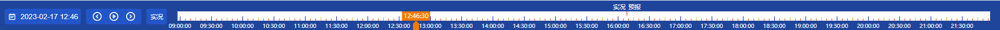

# Timeline 时间轴


## 时间轴组成
1、时间刻度bar  
2、时间面板控制器  
3、当前时间指针  
4、自由指针

插槽TimeBarControlDashboard用于扩展控制器功能

## 时间轴状态
状态:
```js
enum Mode {
    Default,
    Live,
    Manual,
    Auto
};
```
说明:
|状态|描述|详细|
|---|---|---|
|Default|默认状态|自由指针可以任意操作，指向一个自由时间|
|Live|实况模式|指针指向当前时间，随当前时间变化而变化|
|Manual|手动播放|启动播放器时，输出一个控制器，将时间变化交给用户自己定义，订阅事件获取控制器|
|Auto|自动播放|时间轴主动输出一个定时器(setInterval)，订阅事件获取当前时间|  

```js
<script setup>
import {ref} from 'vue'
// import TimeLineMain from '../packages/src/TimeLine/simple/TimeLineMain.vue'
import { TimeLineMain } from '@cdyw/vue3-timeline-bar'

// console.log(Vue3TimelineBar)

import '@cdyw/vue3-timeline-bar/dist/style.css'

const timeLineRef = ref(null)

const datePickerTime = ref(new Date());

const autoAnimationTimeStampChange = (data) => {
  console.log('autoAnimationTimeStampChange ==>', data);
}

let timer = -1;
const manualAnimationTimeStampChange = (controller) => {
  console.log('manualAnimationTimeStampChange ==>', controller);
  let timestamp = controller.currentTimestamp.valueOf();
  timer = setInterval(() => {
    timestamp = timestamp + 60 * 1000;
    console.log('timestamp ==>', timestamp);
    controller.nextTick(timestamp);

    datePickerTime.value = new Date(timestamp);
  }, 1000)
  controller.stop = () => {
    clearInterval(timer);
  }
}


const currentTimeChange = (time) => {
  console.log('currentTimeChange ==>', time);
  datePickerTime.value = new Date(time.valueOf());
}

const datePickerChange = (time) => {
  // console.log('datePickerChange ==>', time)
};

</script>

<template>
  <div>
    <a href="https://vuejs.org/" target="_blank">
      
    </a>
  </div>
  <!-- <TimeLine theme="blue"></TimeLine> -->
  <!-- <TimeLine ref="timeLineRef" theme="blue" @animationTimeChange="animationTimeChange" @animationRangeTimeChange="animationRangeTimeChange" @playAnimationClick="playAnimationClick"></TimeLine> -->
  <div class="time-line-bar">
    <el-date-picker
          v-model="datePickerTime"
          prefix-icon="cdywIF icon-timeline-rili2"
          ref="datePickerRef"
          type="datetime"
          :editable="true"
          format="YYYY-MM-DD HH:mm"
          placeholder="选择日期"
          @change="datePickerChange"/>
 
    <div class="time-line-wrap">
      <TimeLineMain theme="blue"
                ref="timeLineRef"
                :stepSecond="3 * 60 * 1000"
                :playMode="'auto'"
                v-model:value="datePickerTime"
                @autoAnimationTimeStampChange="autoAnimationTimeStampChange"
                @manualAnimationTimeStampChange="manualAnimationTimeStampChange"
                @currentTimeChange="currentTimeChange">
      </TimeLineMain>
    </div>
  </div>
</template>

<style scoped>
.logo {
  height: 6em;
  padding: 1.5em;
  will-change: filter;
  transition: filter 300ms;
}
.logo:hover {
  filter: drop-shadow(0 0 2em #646cffaa);
}
.logo.vue:hover {
  filter: drop-shadow(0 0 2em #42b883aa);
}

.time-line-bar {
  display: flex;
  position: relative;
}

.time-line-wrap {
  position: relative;
  width: 100%;
}
</style>

```

实现：  
使用一个矩阵状态机,定义一个当前状态，状态转换时，调用状态转换函数transform转换功能。
```js
const stateMechine = [
    [noop,           default2live, default2manual, default2auto],
    [live2default,   noop,         live2manual,    live2auto],
    [manual2default, manual2live,  noop,           manual2auto],
    [auto2default,   auto2live,    auto2manual,    noop]
];
```
第一行：default 转换为 其他状态， live、mannual、auto;  
第二行：live    转换为 其他状态， default、mannual、auto;  
第三行：mannual 转换为 其他状态， default、live、auto;  
第四行：auto    转换为 其他状态， default、live、mannual;  

之后如果扩展可以增加状态，并且增大矩阵。


## TimeLineMain
|props|说明|
|---|---|
|theme|主题，内部定义了两套主题default、blue|
|value|输入的当前时间currentTimeStamp|
|onePixelTimeUnit|一像素代表的时间单位长度|
|stepSecond|auto模式下步进单位秒|
|playMode|播放模式切换|


|event|说明|
|---|---|
|change|当前自由指针时间变化|
|autoAnimationTimeStampChange|自动播放动画下事件|
|manualAnimationTimeStampChange|手动播放动画下事件|

```js
//autoAnimationTimeStampChange
const autoAnimationTimeStampChange = (timeStamp) => {
  console.log('autoAnimationTimeStampChange ==>', timeStamp);
}

output:
autoAnimationTimeStampChange ==> 1717664596139
autoAnimationTimeStampChange ==> 1717664776139
autoAnimationTimeStampChange ==> 1717664956139
autoAnimationTimeStampChange ==> 1717665136139
autoAnimationTimeStampChange ==> 1717665316139
autoAnimationTimeStampChange ==> 1717665496139
autoAnimationTimeStampChange ==> 1717665676139
autoAnimationTimeStampChange ==> 1717665856139
```


```js
//manualAnimationTimeStampChange
let timer = -1;
/**
 * controller: {
 *  nextTick, //设置下时刻时间
 *  stop,  // 停止播放
 *  currentTimestamp // 时间指针当前时间戳
 * }
 */
const manualAnimationTimeStampChange = (controller) => {
  console.log('manualAnimationTimeStampChange ==>', controller);
  let timestamp = controller.currentTimestamp.valueOf();
  timer = setInterval(() => {
    timestamp = timestamp + 60 * 1000;
    console.log('timestamp ==>', timestamp);
    controller.nextTick(timestamp);
  }, 1000)
  
  // 用户自己定义停止方式
  controller.stop = () => {
    clearInterval(timer);
  }
}
```

关于自动播放和手动播放(被动播放)的区别：  
1. 自动播放：时间轴主动调用定时器，周期性输出一个时间，给用户使用。  
    优点：不用暴露程序实现，在短时间执行代码100ms内的代码执行 不会导致主线程明显卡顿。  
    缺点：当主动调用频繁时，定时器触发的回调程序可能阻塞主线程，或者过多渲染导致动画帧十分卡顿等。   
    场景：主动调用定时器除非查询和渲染页面的时间(queryTime + renderTime) > 定时器时间(intervalTime),页面没有完成更新马上进行新一次的请求渲染，导致阻塞页面同时内存增大程序崩溃。到时时间轴更新时间 与渲染数据不同步。
2. 手动播放：在于渲染耗时页面时，可以控制时间轴时间变化，当资源与渲染完成更新时间轴时间，虽然在时间上会有延迟，但是保证数据时间同步和页面渲染同步。


